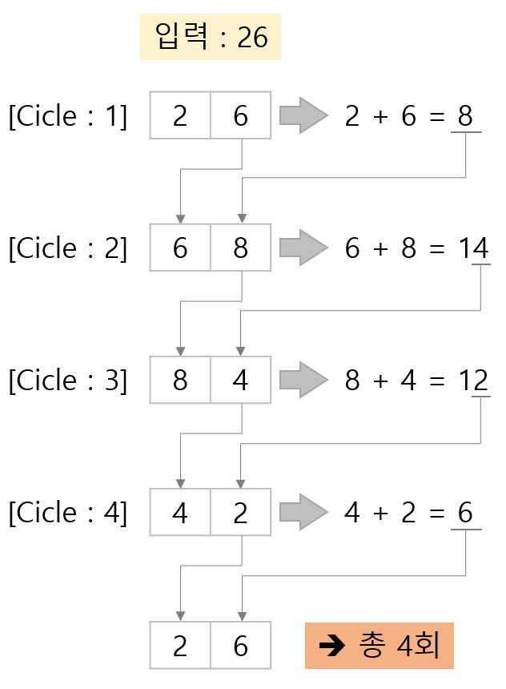

## 문제

0보다 크거나 같고, 99보다 작거나 같은 정수가 주어질 때 다음과 같은 연산을 할 수 있다. 먼저 주어진 수가 10보다 작다면 앞에 0을 붙여 두 자리 수로 만들고, 각 자리의 숫자를 더한다. 그 다음, 주어진 수의 가장 오른쪽 자리 수와 앞에서 구한 합의 가장 오른쪽 자리 수를 이어 붙이면 새로운 수를 만들 수 있다. 다음 예를 보자.

26부터 시작한다. 2+6 = 8이다. 새로운 수는 68이다. 6+8 = 14이다. 새로운 수는 84이다. 8+4 = 12이다. 새로운 수는 42이다. 4+2 = 6이다. 새로운 수는 26이다.

 

위의 예는 4번만에 원래 수로 돌아올 수 있다. 따라서 26의 사이클의 길이는 4이다.

N이 주어졌을 때, N의 사이클의 길이를 구하는 프로그램을 작성하시오.

## 입력

첫째 줄에 N이 주어진다. N은 0보다 크거나 같고, 99보다 작거나 같은 정수이다.

## 출력

첫째 줄에 N의 사이클 길이를 출력한다.

## 입출력 예제

<table text-align="center">
 <tr>
  <th width="40%">

#### 예제 입력

  </th>
  <th width="40%">

#### 출력 예제

  </th>
 </tr>
 <tr>
  <td width="40%">

 **26**

  </td>
  <td width="40%">

 **4**

  </td>  
 </tr>
 <tr>
  <td width="40%">

 **55**

  </td>
  <td width="40%">

 **3**

  </td>  
 </tr>
 <tr>
  <td width="40%">

 **1**

  </td>
  <td width="40%">

 **60**

  </td>  
 </tr> 
</table>

## Tip

`while문`을 이용해서 출력합니다.  
원본 숫자와 사이클을 돌면서 변하는 숫자가 있다. 십의 자리와 일의 자리를 구하기 위한 변수가 필요하다.
반복문을 돌면서 사이클변수의 일의 자리와 원본 숫자의 일의 자리를 합쳐서 사이클변수와 원본 숫자가 같아질 때까지 걸리는 횟수를 구하면 된다.

## 풀이
```c
#include<stdio.h>

int main()
{
	int onum, rnum = 0; //원본 변수, 사이클 변수 선언
	int one, ten;   //일의 자리, 십의 자리 선언
	int count = 0, result = 0;  //카운트, 결과값 저장변수 선언

	scanf("%d", &onum);
	rnum = onum;    //사이클 변수에 원본 변수의 값을 넣는다.

	while (1)
	{
		if (rnum < 10)  //사이클 변수가 10보다 작으면
			ten = 0;    //0으로 초기화
		else            //아니면
			ten = rnum / 10;    //십의 자리 추출
		
		one = rnum % 10;    //일의 자리 추출
		result = (ten + one) % 10;  //결과값의 일의 자리 추출
		count++;    //카운트 증가

		rnum = (one * 10) + result; //두 변수의 일의 자리 붙이기

		if (rnum == onum)   //원본변수와 사이클변수가 같다면
			break;  //반복문 종료
	}

	printf("%d\n", count);  //카운트 값 출력
	return 0;
}
```
---

### [목차로 가기](./../../../../)